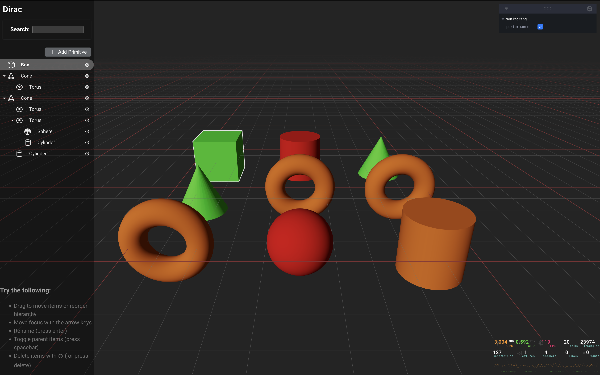

# 3D Tiles + Outliner + WebGPU

## Features

- [x] Add Primitive objects (Box, Sphere, Cone, Torus, Cylinder)
- [x] TransformControls to manipulate 3D objects's position/rotation
- [x] Delete individual primitives or entire subtrees from the Outliner
- [x] Drag-and-drop reordering and nesting items
- [x] Synced hover and selection between 3D scene and Outliner
- [x] Depth-based material colors by hierarchy level
  - Depth 0: Green (#00ff00)
  - Depth 1: Orange (#ff8000)
  - Depth 2: Red (#ff0000)
  - Depth 3+: Gray (#888888)
- [x] Search filter to quickly find items in the Outliner
- [x] Double-click on item to rename

## Credits

- Template: Based on the Vite React Three Fiber (R3F) + TypeScript template. See `pmndrs/react-three-vite` (`https://github.com/pmndrs/react-three-vite`).
- React Three Fiber: `https://github.com/pmndrs/react-three-fiber`
- Zustand: `https://github.com/pmndrs/zustand`
- React-Arborist: `https://github.com/brimdata/react-arborist`

## 🕹️ Getting Started

`npm i`

`npm run dev`

`npm run build`

`npm run preview`
